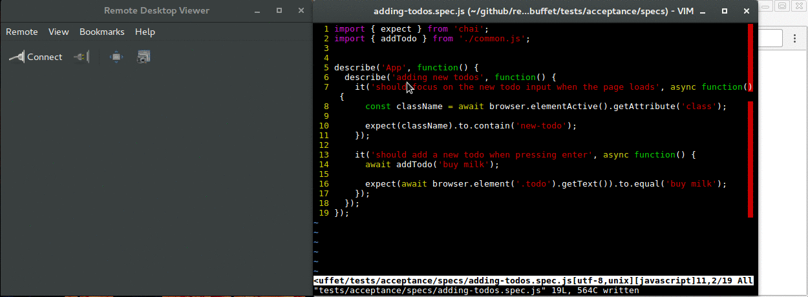

An all-you-can-eat buffet of React TDD
======================================

[](https://travis-ci.org/NiGhTTraX/react-test-buffet) [](https://greenkeeper.io/)

----


## Testing tools

- [Mocha](http://mochajs.org/) - testing framework
- [Chai](http://chaijs.com) - assertion library
- [Sinon](http://sinonjs.org) - mocking library
- [jsdom](https://github.com/tmpvar/jsdom) - server side DOM
- [Babel](https://babeljs.io/) - transpile ES6 (including JSX) to ES5
- [Webpack](https://webpack.github.io/) - module bundler
- [Istanbul](http://gotwarlost.github.io/istanbul/) - code coverage
- [WebdriverIO](http://webdriver.io/) - Selenium 2.0 bindings for NodeJS
- [Selenium](http://www.seleniumhq.org/) - Web Browser Automation
- [Docker](https://www.docker.com/) - containerization platform
- [Mugshot](https://github.com/uberVU/mugshot) - visual regression testing


# Running the app


Running `npm start` will spin up a Docker container that will install the npm
packages and start a Webpack dev server with hot reloading. Changes to the
source code on the host will be reflected inside the container. Having the app
in the container removes the need for devs to install Node and the npm packages
on their machines. This in turn makes it very easy to get rid of problems where
developers get out of sync with the Node version or have stale packages
installed.

If you need to stop/restart the container you can use `npm stop`. Given that you
don't change the `package.json` file, the npm packages will be cached next time
you start the container.

If for some reason you prefer to install everything locally, you can use `npm
run _start` instead.


# Node tests


`npm run test:node` will run the tests in Node using `Mocha`. This is useful for
a rapid feedback loop. You can also watch them for changes with `npm run
test:node:watch`. `jsdom` is used for providing a browser like environment.


## Debugging the node tests


`npm run test:node:debug` will run the same Mocha tests and attach the Node
inspector. Use Chrome to go to [chrome://inspect](chrome://inspect) and debug
the tests with the Chrome dev tools.


## Coverage


The tests automatically generate coverage reports using `Istanbul`. You can find
them in the [tests/results/coverage](./tests/results/coverage/index.html)
folder. **Both Node tests and GUI tests report coverage** which allows
reaching 100% coverage for those cases where Node tests are not enough (scroll
event handlers, browser quirks, etc.).


# GUI tests


The tests open actual browsers (Chrome and Firefox) and control them through
`Selenium`. Everything happens in `Docker` containers for stable and
reproducible builds.


## Visual regression tests


If you want to also take a screenshot after a GUI test and
compare it on the next runs, simply use `vit` (_visual_ it) instead of
`it`.

```js
import { describe, vit } from './suite.js';

describe('My app', () => {
    vit('should look the same', async browser => {
      await browser.click('.foobar');
    });
});
```

The screenshot will be taken at the end of the test definition
only if there were no exceptions thrown. Think of it as an extra
assertion at the end of the test.

If there are any visual changes a diff will be created highlighting
them and the test will fail. If the changes are deliberate you should
commit the new screenshot and rerun the tests. You can find the new
screenshots and diffs in the
[tests/gui/screenshots](./tests/gui/screenshots) folder.

> TODO: these tests don't benefit from Jest's parallel runner
because image comparison is
[super slow](https://github.com/facebook/jest/issues/5163#issuecomment-355509597)
in a Jest sandbox.


## Debugging the GUI tests



Add `debugger` statements in your tests and run `npm run test:gui:debug`.
The tests won't start until you connect to the debugger by going to
[chrome://inspect](chrome://inspect) and selecting the local debugger target.
You're going to need [Chrome
55+](https://nodejs.org/en/docs/inspector/#chrome-devtools-55) for this to work.

Once in the inspector, press the continue execution button and the tests will
start running.

Alongside debugging the test code, you can also follow the state of the browser
by connecting with VNC to [localhost:5900](vnc://localhost:5900) with the
password `secret`.
