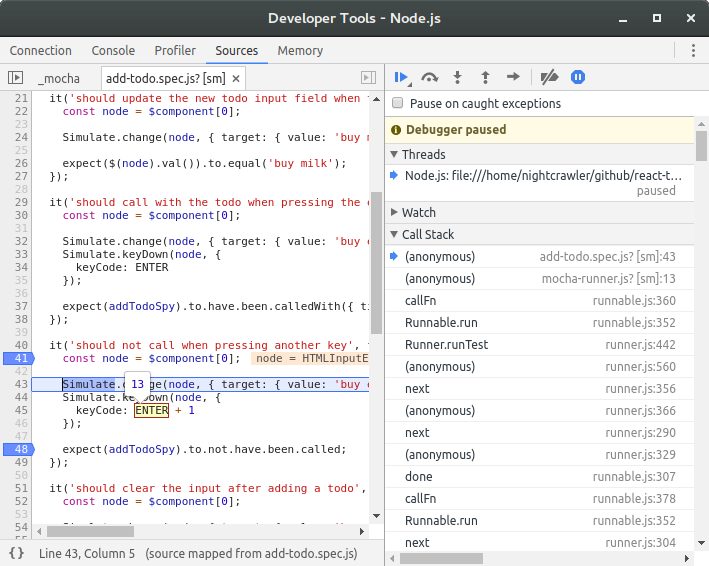
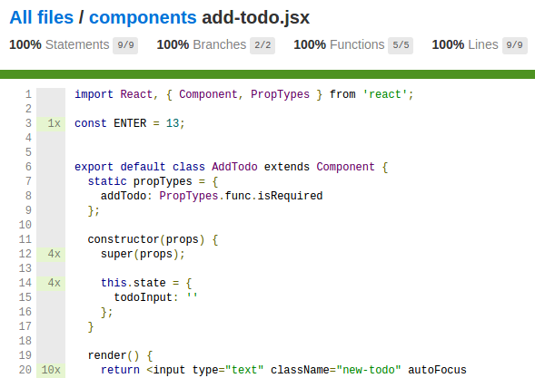

An all-you-can-eat buffet of React TDD
======================================

----

## Testing tools

- [Mocha](http://mochajs.org/) - testing framework
- [Chai](http://chaijs.com) - assertion library
- [Sinon](http://sinonjs.org) - mocking library
- [jsdom](https://github.com/tmpvar/jsdom) - server side DOM
- [Babel](https://babeljs.io/) - transpile ES6 (including JSX) to ES5
- [Webpack](https://webpack.github.io/) - module bundler
- [Istanbul](http://gotwarlost.github.io/istanbul/) - code coverage
- [WebdriverIO](http://webdriver.io/) - Selenium 2.0 bindings for NodeJS
- [Selenium](http://www.seleniumhq.org/) - Web Browser Automation
- [Docker](https://www.docker.com/) - containerization platform

# Unit tests

Unit tests should check a single unit at a time - in the case of UI, a single
component. And what I mean by single component is exactly that, rendering only
one component, without any child components.

Why? Because unit tests should clearly separate your concerns.

If you render `Checkbox` alongside `Todo` you couple them together. And testing
`Todo` in this way will also test `Checkbox` and if `Checkbox` suddenly has a
bug then your tests will tell you that `Todo` also has a bug, which is not true.

## Running the tests in Node

`npm run test:unit` will run the tests in Node using `Mocha`. This is useful for a rapid
feedback loop. You can also watch them for changes with `npm run
test:unit:watch`.

`jsdom` is used for providing a DOM implementation in Node. `jsdom` is pretty
cool, but it falls short when you need additional browser behavior like local
storage or style cascading.

## Debugging the tests

`npm run test:unit:debug` will build a bundle using `webpack` that you can open
in your favorite browser by going to
[tests/unit/debug.html](./tests/unit/debug.html). You can then use the dev tools
and set breakpoints and step through your code. I find this easier than
debugging in Node with the node inspector.

## Coverage

The unit tests automatically generate coverage reports using `Istanbul`. You can
find them in the
[tests/unit/results/coverage](./tests/unit/results/coverage/index.html) folder.

# Acceptance tests

Use these to validate the client needs of your product. Always start with a
failing acceptance test for every new feature. Then write failing unit tests to
drive your design.

The tests open an actual browser and control it through `Selenium`. Everything
happens in `Docker` containers for stable and reproducible builds.

## Debugging the acceptance tests

### Watching the browser

Run `npm run test:acceptance:debug` and when you start seeing output from the
test command connect to `vnc://localhost:5900` with the password `secret`. Sit
back and enjoy the browser doing things too fast for you to actually comprehend
what's going on.

### Debugging the page

Add `browser.debug()` inside your test and run `npm run test:acceptance:debug`.
You will get a REPL where you can access the global `browser` instance. You
could also connect to the browser using VNC and manipulate it any way you want.

### Debugging the tests

Add `browser.debug()` inside your test and run `npm run test:acceptance:debug`.
When at the REPL, open the debug URL in a browser, set your breakpoints, and
type `.exit` in the REPL to continue debugging in Chrome DevTools.
